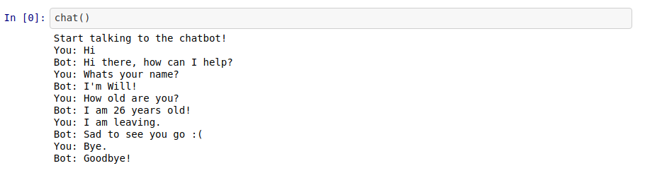

# Simple-ChatBot

A simple chatbot which responds to some basic questions provided by the user.

# About this Project

A simple chatbot which responds to some basic questions provided by the user.

# Getting Started

**Prerequisites**

To run this project, you'll need to have a basic environment to run a python jupyter notebook, that can be found here.

**Installing**

Cloning the Repository

    $ git clone https://github.com/awcasella/Simple-ChatBot.git

    $ cd Simple-ChatBot
  
Installing python libraries

    $ pip3 install nltk

    $ pip3 install numpy

    $ pip3 install tflearn

    $ pip3 install tensorflow==1.5
    
    $ pip3 install jupyter-notebook

Start project
    
    $ jupyter notebook

# Built With
- [Tensorflow](https://www.tensorflow.org): An end-to-end open source machine learning platform.

# References
- Python ChatBot Tutorial. Tech With Tim. Available at: [https://www.youtube.com/playlist?list=PLzMcBGfZo4-ndH9FoC4YWHGXG5RZekt-Q](https://www.youtube.com/playlist?list=PLzMcBGfZo4-ndH9FoC4YWHGXG5RZekt-Q). Access in February, 2020.
